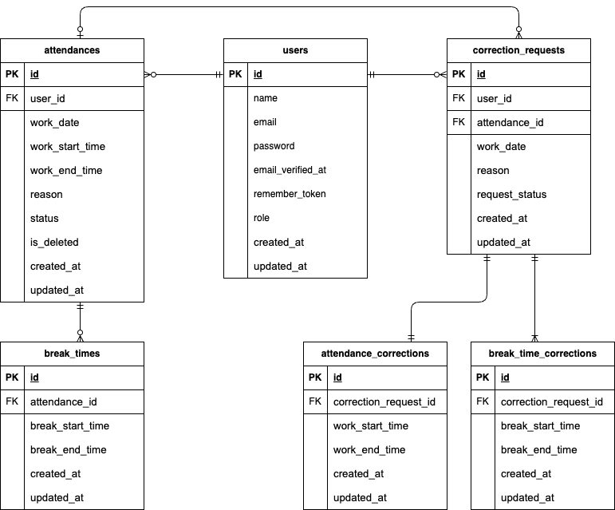

# 目次

1. [アプリケーション概要](#アプリケーション概要)
2. [使用技術](#使用技術)
3. [環境構築手順](#環境構築手順)
4. [各種ツール設定](#各種ツール設定)
5. [各種アクセスURL](#各種アクセスURL)
6. [テーブル仕様／ER図](#テーブル仕様)
7. [テストアカウント](#テストアカウント)
8. [その他仕様](#その他仕様)

<a id="アプリケーション概要"></a>
## ■アプリケーション概要

アプリケーション名：coachtech 勤怠管理アプリ<br>
概要：ある企業が開発した独自の勤怠管理アプリ。<br>
ユーザーの勤怠と管理を目的とする。<br>
初年度でのユーザー数1000人達成を目指す。

<a id="使用技術"></a>
## ■使用技術

### バックエンド

| 言語／フレームワーク     | バージョン   |
| --------------------- | ---------- |
| PHP                   | 8.3        |
| Laravel               | 10.49.1    |

### サーバー/DB

| サーバー/DB | バージョン |
| --------------------- | ---------- |
| Nginx                 | 1.28.0     |
| MySQL                 | 8.4.0      |

### フロントエンド

- JavaScript
- CSS
- View: Blade
- パッケージ管理: npm（未使用）

### テスト

- ユニットテスト (Unit/Feature): PHPUnit

### 開発環境

- コンテナ仮想化 : Docker
- メールテスト: MailHog

<a id="環境構築手順"></a>
## ■環境構築手順

### 1. 前提条件

- Git
- Docker Desktop

### 2. Dockerビルド/Laravel環境構築

1. このリポジトリをクローンします。

    ```bash
    git clone https://github.com/HARP0315/AttendanceSystem.git
    ```

2. Docker Desktopアプリを立ち上げます。

3. プロジェクトのルートディレクトリに移動し、以下コマンドを実行します。

    ```bash
    make init
    ```

※M1/M2 Mac ユーザーの方
no matching manifest for linux/arm64/v8 in the manifest list entries というエラーが表示された場合は、`docker-compose.yml`ファイルのmysqlサービスにplatform: linux/x86_64を追加してください。

```mysql
  platform: linux/x86_64 # この行を追加
  image: mysql:8.0.26
  # ...
```

### 3. アプリケーションへのアクセス

- 管理者ログイン: [http://localhost/admin/login](http://localhost/admin/login)
- スタッフログイン: [http://localhost/login](http://localhost/login)

ログイン後、それぞれのトップページに遷移します。

<a id="各種ツール設定"></a>
## ■各種ツール設定

### MailHog (メールテスト)

- **目的**: 開発環境で送信されるメールをキャッチし、実際のメールアドレスに送信せずに内容を確認します。
- **アクセス**: [http://localhost:8025](http://localhost:8025)

### PHPUnit (ユニットテスト/フィーチャーテスト)

- **目的**: アプリケーションの内部ロジックをテストします。
- **設定**:

    1. `phpunit.xml`ファイルを開き、以下の行が含まれているか確認してください。

        ```xml
        <php>
            # ...
            <server name="APP_ENV" value="testing"/>
            <server name="DB_DATABASE" value="test_database"/>
            # ...
        </php>
        ```

    2. `.env`ファイルをコピーして`.env.testing`ファイルを作成します。

        ```bash
        cp .env .env.testing
        ```

    3. `.env.testing`ファイルの下記環境変数の編集および追加を行います。

        ```env
        （編集）
        APP_ENV=testing

        # ...
        （編集）
        DB_DATABASE=test_database
        # ...

        （追加）
        DB_USERNAME=root
        DB_PASSWORD=... ←docker-compose.ymlファイル記載のrootパスワードを追加
        ```

- **テスト実行前の準備 (初回のみ)**:

  テスト用のデータベース／テーブルを作成します。

  ```bash
  # 1. MySQLコンテナに入る
  docker-compose exec mysql bash

  # 2. MySQLクライアントに接続する
  (パスワードを求められたら `docker-compose.yml`ファイルの MYSQL_ROOT_PASSWORD を入力)
  mysql -h mysql -u root -p

  # 3. MySQLプロンプトで、テスト用データベースを作成する
  CREATE DATABASE test_database;

  # 4. MySQLクライアントを終了する
  exit;

  # 5 MySQLコンテナから出る
  exit;

  # 6 PHPコンテナに入る

  # 7 テーブルを作成する
  php artisan migrate:fresh --env=testing
  ```

- **実行**: PHPコンテナ内で以下のコマンドを実行します。

  ```bash
  # テスト実行
  php artisan test
  php artisan test
  ```

<a id="各種アクセスURL"></a>
## ■各種アクセスURL

- 開発環境：[http://localhost/](http://localhost/)
- MailHog：[http://localhost:8025](http://localhost:8025)
- phpMyAdmin:：[http://localhost:8080/](http://localhost:8080/)

<a id="テーブル仕様"></a>
## ■テーブル仕様／ER図

### usersテーブル

| カラム名 | 型 | primary key | unique key | not null | foreign key |
| --- | --- | --- | --- | --- | --- |
| id | bigint | ◯ |  | ◯ |  |
| name | varchar(255) |  |  | ◯ |  |
| email | varchar(255) |  | ◯ | ◯ |  |
| email_verified_at | timestamp |  |  |  |  |
| password | varchar(255) |  |  | ◯ |  |
| remember_token | varchar(100) |  |  |  |  |
| role | tinyint |  |  | ◯ |  |
| created_at | timestamp |  |  |  |  |
| updated_at | timestamp |  |  |  |  |

### attendancesテーブル

| カラム名 | 型 | primary key | unique key | not null | foreign key |
| --- | --- | --- | --- | --- | --- |
| id | bigint | ◯ |  | ◯ |  |
| user_id | bigint |  | ◯ | ◯ | users(id) |
| work_date | date |  | ◯ |  |  |
| work_start_time | time |  |  |  |  |
| work_end_time | time |  |  |  |  |
| reason | varchar(255) |  |  |  |  |
| status | tinyint |  |  |  |  |
| is_deleted | tinyint |  |  | ◯ |  |
| created_at | timestamp |  |  |  |  |
| updated_at | timestamp |  |  |  |  |

### break_timesテーブル

| カラム名 | 型 | primary key | unique key | not null | foreign key |
| --- | --- | --- | --- | --- | --- |
| id | bigint | ◯ |  | ◯ |  |
| attendance_id | bigint |  |  | ◯ | attendances(id) |
| break_start_time | time |  |  |  |  |
| break_end_time | time |  |  |  |  |
| created_at | timestamp |  |  |  |  |
| updated_at | timestamp |  |  |  |  |

### correction_requestsテーブル

| カラム名 | 型 | primary key | unique key | not null | foreign key |
| --- | --- | --- | --- | --- | --- |
| id | bigint | ◯ |  | ◯ |  |
| user_id | bigint |  |  | ◯(work_dateとの組み合わせ) | users(id) |
| attendance_id | bigint |  |  |  | attendances(id) |
| work_date | date |  |  | ◯(user_idとの組み合わせ) |  |
| reason | varchar(255) |  |  | ◯ |  |
| request_status | tinyint |  |  | ◯ |  |
| created_at | timestamp |  |  |  |  |
| updated_at | timestamp |  |  |  |  |

### attendance_correctionsテーブル

| カラム名 | 型 | primary key | unique key | not null | foreign key |
| --- | --- | --- | --- | --- | --- |
| user_id | bigint |  |  | ◯ | users(id) |
| correction_request_id | bigint |  |  | ◯ | correction_requests(id) |
| work_start_time | time |  |  |  |  |
| work_end_time | time |  |  |  |  |
| created_at | timestamp |  |  |  |  |
| updated_at | timestamp |  |  |  |  |

### break_time_correctionsテーブル

| カラム名 | 型 | primary key | unique key | not null | foreign key |
| --- | --- | --- | --- | --- | --- |
| user_id | bigint |  |  | ◯ | users(id) |
| correction_request_id | bigint |  |  | ◯ | correction_requests(id) |
| break_start_time | time |  |  |  |  |
| break_end_time | time |  |  |  |  |
| created_at | timestamp |  |  |  |  |
| updated_at | timestamp |  |  |  |  |

### ER図



<a id="テストアカウント"></a>
## ■テストアカウント

### 管理者

name: 管理者<br>
email: 1234@1234<br>
password: 12341234

### スタッフ

name: スタッフ一郎<br>
email: general1@gmail.com<br>
password: password

name: スタッフ二郎<br>
email: general2@gmail.com<br>
password: password

その他、全8名のスタッフのダミーデータを作成しています

<a id="その他仕様"></a>
## ■その他仕様
